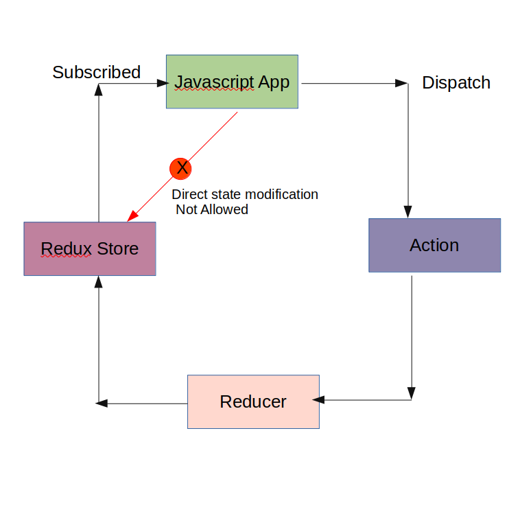

# Redux Concepts

## Three core concepts of redux

- Store (Holds the state of your application)
- Action (Describes what happened, performed activity e.g. an order placed )
- Reducer (Ties the store and actions together, it decides how to updates the state in store according to actions)

## Three Principles of redux

- The global state of an Application is stored as an Object inside a single store( managed by redux store).
    - `{
    isLogged : false,
    firstNam : "Test"
} `
- The way only way to change the state is to dispatch an action, an object that describes what happened.
    - To update the state of your app, you need to let the Redux know that with an action.
    - We are not allowed to changed the state directly
    - Action is a simple object having an property of `type`
        - `{type : "LOG_IN"}`
    - Actions carry some information from your app to the redux store.
- To specify how the state tree is updated based on actions , you write pure reducers.
    - Pure reducers are actually pure functions that take previous state and returns new state according to action type
    - `
    const reducer = (state = initialState, action) => {
        switch (action.type) {
            case "LOG_IN":
                return {
                    isLogged : true,
                    ...state
                    }
                }
            }`
    

# Actions

- They are javascript objects containing property of type and payload(we could have actions with out payload e.g. an action to logout the user)
- Actions carry some information from your app to the redux store 
- The `type` property is typically defined as string constant.
- `const LOG_IN = "LOG_IN"`
    ` {
        type: LOG_IN
        }`
- ## Action Creator
    - It is a function that returns an actions

    `funtion signOut() {
        return {
        type: LOG_IN
        }
    }`
# Reducers
- Reducers specify how the app's state changes in response to actions sent to the store.
- Function that accepts state and action as arguments and returns the new / next state of the application.
- `(previousState, action) => newState`

# Redux Store
- One store for the entire application
- ## Responsibilities
    - Holds application state
    - Allows access to state via `getState()`
    - Allows state to b updated via `dispatch(action)`
    - Register listeners via `subscribe(listener)`. Store allows our application to register listeners through the `subscribe` method , it accepts a function as an argument which is executed any time the state in the redux store changes. 